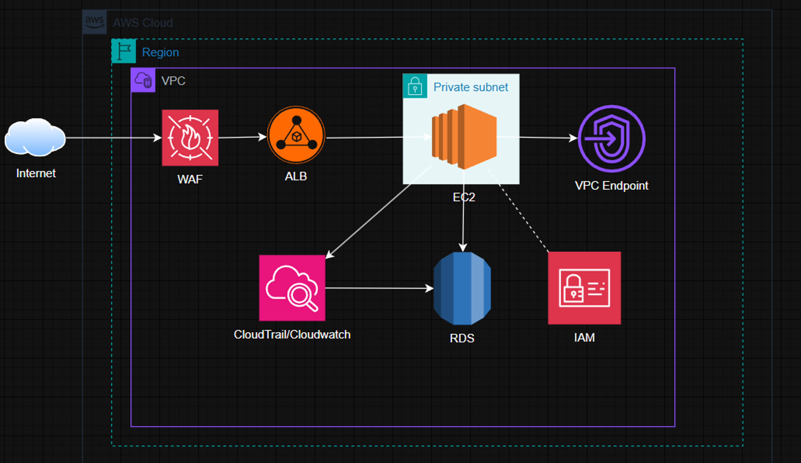

## ZERO TRUST NETWORK SECURITY IMPLEMENTATION  
**Nguyễn Kim Kha**  
Amazon Web Services  

---

## TÓM TẮT ĐIỀU HÀNH  
Hệ thống cũ dễ bị tấn công, khó mở rộng, chi phí cao.  
**Mục tiêu**: Áp dụng mô hình Zero Trust để tăng bảo mật và giảm chi phí.  
**Lợi ích**:  
- Bảo mật cao hơn  
- Tuân thủ tốt hơn  
- Giảm chi phí từ ~$250 xuống ~$96 mỗi tháng (tiết kiệm ~61%)

---

## VẤN ĐỀ VÀ HẬU QUẢ  
- Máy chủ có IP công khai → nguy cơ bị khai thác qua SSH, HTTP  
- Thiếu giám sát tập trung → mất dấu vết tấn công  
- Gartner (2024): 60% doanh nghiệp từng bị gián đoạn do lỗi bảo mật cloud  
- Không đáp ứng chuẩn **PCI-DSS** (quy định ngành thanh toán)

---

## MỤC TIÊU DỰ ÁN  
- Tách biệt tài nguyên bằng VPC và private subnet  
- Kiểm soát truy cập chi tiết bằng IAM, RBAC  
- Giám sát bảo mật theo thời gian thực: GuardDuty, CloudTrail  

---

## DỊCH VỤ AWS CHÍNH  
- **Tính toán**: EC2 (ứng dụng), ALB (phân phối tải)  
- **Cơ sở dữ liệu**: RDS PostgreSQL (multi-AZ)  
- **Bảo mật**: IAM, WAF, GuardDuty, KMS (mã hóa)  
- **Giám sát**: CloudTrail, CloudWatch  
- **Mạng**: VPC, VPC Endpoints, Security Groups  

---

## KIẾN TRÚC BẢO MẬT  
- **Zero Trust**: Mọi kết nối đều bị nghi ngờ cho đến khi xác minh  
- **IAM**: Least Privilege – mỗi role chỉ truy cập đúng chức năng  
- **WAF**: Ngăn DDoS, SQLi, XSS tại tầng ALB (OWASP Top 10)  
- **GuardDuty**: Phát hiện truy cập trái phép, mã độc, hành vi bất thường  

---

## KẾ HOẠCH TRIỂN KHAI (5 GIAI ĐOẠN)

| Giai đoạn  | Nội dung                                                                 |
|------------|--------------------------------------------------------------------------|
| Tuần 1     | Thiết kế kiến trúc, tính toán chi phí AWS                               |
| Tuần 2     | Cấu hình VPC, tạo subnet, thiết lập IAM & bảo mật mạng                   |
| Tuần 3-4   | Cài đặt EC2, RDS, tích hợp ALB + WAF, giám sát, kiểm thử compliance      |

---

## PHÂN TÍCH ROI

| Mục tiêu             | Trước AWS                        | Sau khi dùng AWS               |
|----------------------|----------------------------------|-------------------------------|
| Chi phí              | ~250 USD/tháng                   | ~96 USD/tháng                 |
| Bảo mật              | Tự triển khai bảo mật riêng       | Tích hợp sẵn bảo mật AWS      |
| Khả năng mở rộng     | Khó mở rộng, thủ công             | Dễ dàng với autoscaling       |
| Tuân thủ             | Không rõ ràng                     | Tuân thủ PCI-DSS, GDPR        |
| Tiết kiệm            | —                                | ~61% chi phí                  |

---

## RỦI RO & KẾT QUẢ KỲ VỌNG

| Tiêu chí                      | Kết quả kỳ vọng                                                  |
|------------------------------|-------------------------------------------------------------------|
| Public IP                    | Không có → giảm khả năng bị quét port                             |
| Độ sẵn sàng (Uptime)         | >99.99% với Multi-AZ                                              |
| Mã hóa dữ liệu               | 100% bằng KMS → tuân thủ GDPR, PCI                               |
| Hiệu suất xử lý              | 50.000 người dùng đồng thời trong peak sale                      |
| Hạ tầng                      | Autoscaling, tích hợp CI/CD, DevSecOps                           |
| Tuân thủ                     | Dễ kiểm toán, mở rộng sang CRM, ERP                              |

---

## LỢI ÍCH DÀI HẠN  
- Hạ tầng mở rộng dễ với autoscaling, Lambda  
- Hỗ trợ CI/CD, DevSecOps  
- Sẵn sàng kiểm toán & tuân thủ ngành  
- Dễ nhân rộng sang hệ thống khác: CRM, ERP, nội bộ  

---

## PHỤ LỤC  

**Sơ đồ kiến trúc (mô tả)**:  

**Mô tả luồng chính**:  
Internet → ALB → WAF → EC2 (private subnet) → RDS  
- Kết nối qua VPC Endpoint  
- Giám sát bởi CloudTrail & CloudWatch  
- IAM quản trị quyền  

**Tài liệu kỹ thuật đi kèm**:  
- Mẫu policy IAM  
- Template CloudFormation  
- Link AWS Pricing Calculator  
- Báo cáo giám sát từ CloudWatch Logs  

---

## LIÊN HỆ  
**THANK YOU**  
📞 096-311-2964  
✉️ nguyenkimkha.contact@gmail.com  
🔗 [LinkedIn](https://www.linkedin.com/in/nguyenkimkha)  
